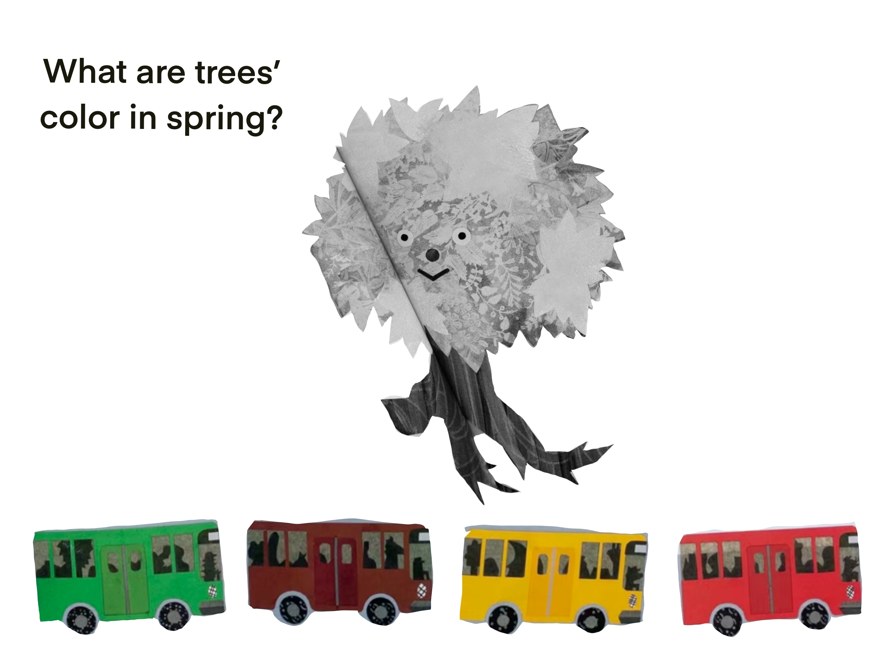
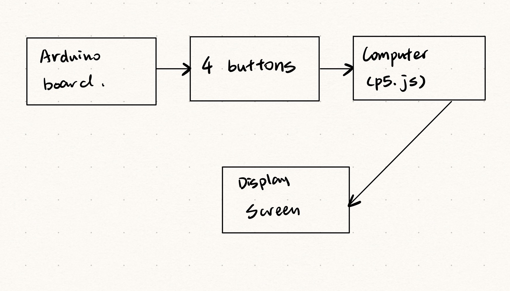
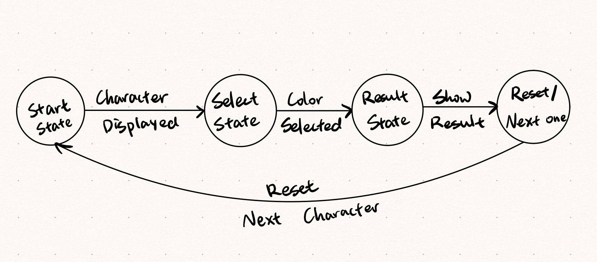

# Rainbow Rides: The Interactive Color Recognition Game for Kids
Inspired by the educational comics “The Bus of Many Colors” created by a Japanese artist Tupera Tupera, which teaches kids the concept of color recognition of different figures, such as trees, tomatoes, eggs. Based on this book, I’d like to create a game for children to interactively explore and reaffirm their knowledge of colors, and reinforce their learning through interactive play.  

*Description of any sensor, output component or mechanism that you are planning on using or building*  

1. Random Figure Display: Display a random figure in black and white on the screen.  This could include a variety of objects and characters from the book, ensuring a diverse learning experience.  

2. Voice Prompts: Offer hints before selection, like a voiceover saying, “What are trees’ color in spring?”.  

3. Colored Buses Selection: Underneath the figure, show four colored buses (e.g., green, red, yellow, brown). Each color corresponds to a button on the Arduino board.  

4. Arduino Button Interaction: The child uses the buttons on the Arduino board to select the bus that matches the figure's 'natural' color.  For instance, choosing the green bus for the tree.  

5. Immediate Feedback: After a selection is made, provide immediate feedback. If correct, show a colored figure with a cheerful sound. If incorrect, offer another chance to choose.

*System diagram*  
  

*FSM diagram*
  

*Circuit diagram*
  

*Description of any external data or library that you are planning to use* 
Use ps.speech for voiceover prompts  
https://cdn.jsdelivr.net/gh/IDMNYU/p5.js-speech@0.0.3/lib/p5.speech.js

Maybe use p5.play for character's movement
https://p5play.org/learn/

*Plan for user testing*

*Short discussion of why your project is relevant:*  

*How is it related to our readings?*  

According to Crawford's definition, this project can be seen as highly interactive. It engages the user in a continuous loop of input (button presses), processing (evaluating the correctness of the choice), and output (providing visual and auditory feedback), which aligns well with the conversational model of interactivity that Crawford advocates. This interactive design not only makes the game engaging for children but also reinforces the educational aspect of color recognition through a dynamic and responsive learning experience.

*How does it connected to society?*  

1. Early Learning Development: The game aids in the cognitive development of young children by teaching them color recognition, an essential early learning skill. This foundational knowledge is crucial for their subsequent educational journey.  

2. Interactive Learning: By integrating technology and interactive play, the game reflects modern educational approaches, emphasizing the importance of engaging and interactive learning methods in early childhood education.  

3. STEM Education Promotion: Using an Arduino board and a computer program for an educational game aligns with the growing emphasis on STEM education, encouraging children to explore these fields playfully.  

4. Adapting to Changing Educational Needs: The game represents an adaptation to the evolving educational landscape, where traditional learning methods are increasingly supplemented with innovative, interactive techniques.  

*Why is it important to me?*  

As a design with a focus on tangible electronics for teaching and learning, this project can achieve my principles of user-centered design: 

1. Intuitive Interaction: The use of tangible buttons on the Arduino board for color selection is intuitive for young children. This design choice is based on the understanding that young users can more easily interact with physical objects than abstract concepts.  

2. Engaging and Relevant Content: The game's content, derived from a popular children's book, is already familiar and engaging to the target audience, enhancing their learning experience.  

3. Hands-On Learning: The use of an Arduino board with physical buttons embodies the essence of tangible electronics. It offers a hands-on experience that is often more engaging and memorable for children compared to the traditional storybook.  

4. Bridging Digital and Physical Worlds: This project seamlessly integrates the physical interaction with digital feedback, providing a holistic learning experience that resonates with the way children interact with the world.